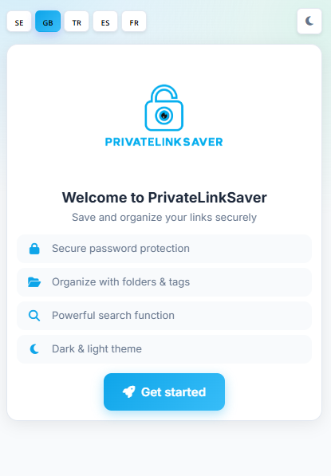
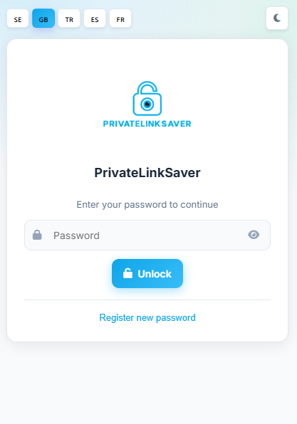
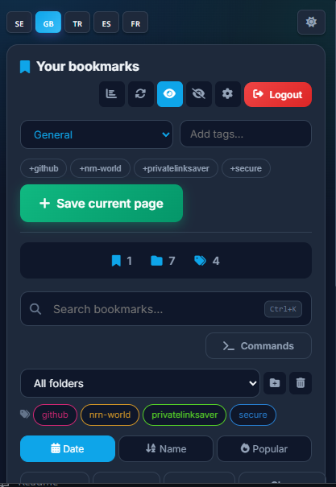
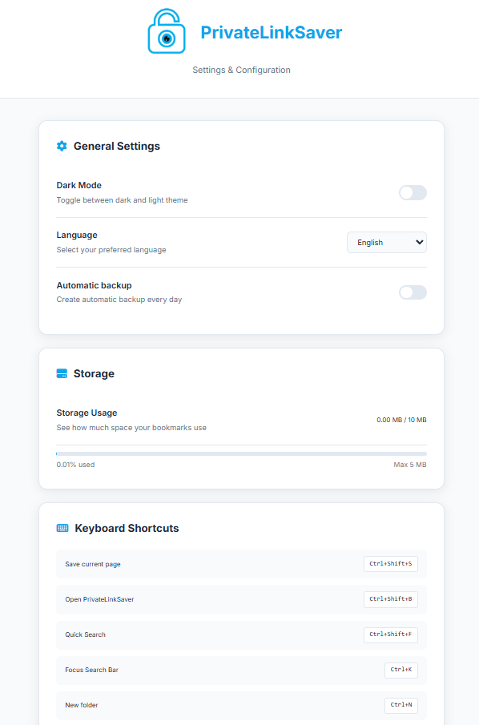

# PrivateLinkSaver

PrivateLinkSaver is a privacy-first Chrome extension for saving and organizing links with a fast, modern workflow.

It is built for users who want clean bookmarking without cloud lock-in, subscriptions, or external storage dependencies.


## Table of Contents

- [Overview](#overview)
- [Key Features](#key-features)
- [Security and Privacy](#security-and-privacy)
- [Installation](#installation)
- [Usage](#usage)
- [Screenshots](#screenshots)
- [Keyboard Shortcuts](#keyboard-shortcuts)
- [Architecture](#architecture)
- [Development](#development)
- [Release Packaging](#release-packaging)
- [Contributing](#contributing)
- [License](#license)
- [Author](#author)

## Overview

PrivateLinkSaver helps you capture links in one click, organize them with folders and tags, and find them instantly with smart search.

Everything runs locally inside the browser extension environment.

## Key Features

### Smart Saving
- Save current page from popup, context menu, or shortcut
- Canonical URL normalization and tracking-parameter cleanup
- Duplicate prevention based on canonical URL matching
- Smart tag suggestions inferred from page title and domain

### Organization and Search
- Folder system with custom colors
- Tag filtering and quick folder actions
- Relevance-ranked search (title, URL, tags, folder)
- Sort by date, title, and visit count

### Productivity
- Command Palette (`Ctrl+Shift+P`) for quick actions
- Omnibox support via keyword `pls`
- Backup and restore tools
- JSON import/export

### User Experience
- Clean modern popup interface
- Light/dark theme support
- Multi-language UI: English, Swedish, Turkish, Spanish, French

## Security and Privacy

- Password protection using PBKDF2-SHA256 hashing
- Legacy SHA-256 password hashes remain supported for backward compatibility
- Data is stored locally via `chrome.storage.local`
- No analytics SDKs or remote user tracking
- Favicon previews can use Google's favicon endpoint for visual display

For policy details, see `PRIVACY.md`.

## Installation

### Option A: Load Unpacked (recommended for development)
1. Clone or download this repository
2. Open `chrome://extensions`
3. Enable **Developer mode**
4. Click **Load unpacked**
5. Select the project folder (the folder containing `manifest.json`)

### Option B: Chrome Web Store submission
1. Create a ZIP with extension files where `manifest.json` is at ZIP root
2. Upload ZIP in the Chrome Web Store Developer Dashboard

## Usage

1. Open the extension from the Chrome toolbar
2. Register a password on first launch
3. Save your current page
4. Organize bookmarks with folders/tags
5. Use search, sort, and command palette for quick navigation

## Screenshots

Click any image to view it in full size.

| First Launch | Create Password |
|---|---|
| <a href="Screenshot/Start1.png"></a> | <a href="Screenshot/Create%20Password.png"></a> |

| Login | Popup Menu |
|---|---|
| <a href="Screenshot/Login.png"></a> | <a href="Screenshot/Menu.png"></a> |

| Settings |
|---|
| <a href="Screenshot/Settings.png"></a> |

## Keyboard Shortcuts

| Shortcut | Action |
|---|---|
| `Ctrl+Shift+S` | Save current page |
| `Ctrl+Shift+B` | Open PrivateLinkSaver |
| `Ctrl+Shift+F` | Quick search |
| `Ctrl+Shift+P` | Open command palette |
| `Ctrl+K` | Focus search |
| `Ctrl+N` | Create new folder |
| `Ctrl+D` | Save current page |
| `Esc` | Clear search or close modal |

## Architecture

```text
PrivateLinkSave/
|- manifest.json
|- popup.html
|- options.html
|- scripts/
|  |- background.js
|  |- popup.js
|  |- options.js
|  |- storage.js
|  |- crypto.js
|  `- translations.js
|- styles/
|  `- popup.css
|- icons/
|- _locales/
|- PRIVACY.md
|- LICENSE
`- README.md
```

## Development

### Stack
- Manifest V3
- Vanilla JavaScript
- Web Crypto API
- Chrome Storage API

### Local workflow
1. Update code
2. Reload extension in `chrome://extensions`
3. Validate key flows (save/edit/delete/search/backup)
4. Commit and push

## Release Packaging

When preparing a store upload ZIP:

- Include only extension files and assets
- Keep `manifest.json` at ZIP root
- Exclude `.git`, editor folders, and local artifacts

## Contributing

Contributions are welcome.

1. Fork the repository
2. Create a branch: `git checkout -b feature/your-change`
3. Commit updates
4. Push branch
5. Open a pull request

## License

This project is licensed under MIT. See `LICENSE`.

## 🙏 Support

If you like this project, consider:

* ⭐ Star the project on GitHub  
* ☕ [Buy me a coffee](https://buymeacoffee.com/nrnworld)  
* 📢 Share with your friends  
